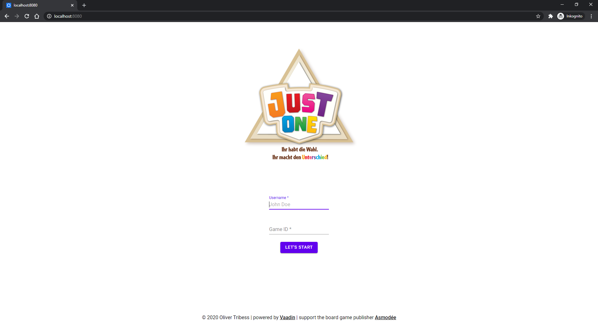

# Just One Online
[](https://github.com/Tait1337/just-one/actions)
[](https://sonarcloud.io/dashboard?id=Tait1337_just-one)
[](LICENSE)

Web Application version of Asmodée's Just One board game.

## Getting Started

These instructions will get you a copy of the project up and running on your local machine for development and testing purposes. See deployment for notes on how to deploy the project on a live system.

### Prerequisites

Install Java JDK 11 or higher.

```
https://openjdk.java.net/install/index.html
```

Install Docker.
```
https://docs.docker.com/get-docker/
```

### Installing

Clone the Repository.
```
git clone https://github.com/tait1337/just-one.git
```

Run the Web Application.
```
mvn spring-boot:run
```

Navigate to http://localhost:8080.
Hint: click on the Logo to watch the [introduction Video](https://youtu.be/IzXhC_NQctg).



Join a game with up to 7 player.


### Configuration

Within [src/main/resources/carddeck.csv](carddeck.csv) you can modify game cards.

## Running the tests

No Tests.

## Deployment

The most basic option to run the Application is by building the Dockerimage.

```
mvn spring-boot:build-image -Pproduction
docker run -p 8080:8080 -d just-one:1.0.0-SNAPSHOT
```

## Contributing

I encourage all the developers out there to contribute to the repository and help me to update or expand it.

To contribute just create an issue together with the pull request that contains your features or fixes.

## Versioning

We use [GitHub](https://github.com/) for versioning. For the versions available, see the [tags on this repository](https://github.com/tait1337/just-one/tags).

## Authors

* **Oliver Tribess** - *Initial work* - [tait1337](https://github.com/tait1337)

## License

This project is licensed under the GNU General Public License v3.0 - see the [LICENSE.md](LICENSE.md) file for details

## Acknowledgments

* Original Board Game Publisher [Asmodée](https://asmodee.com/)
* [AdoptOpenJDK](https://adoptopenjdk.net/) Team for providing a free JDK
* [Vaadin](https://vaadin.com/) Team for providing the open-source platform to build web apps with Java
* [Spring](https://spring.io/) Team for providing the Service creation platform to build stand-alone web apps